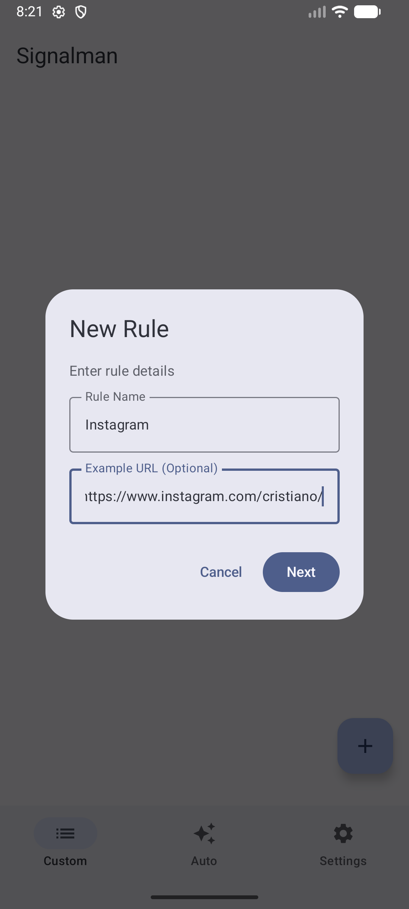
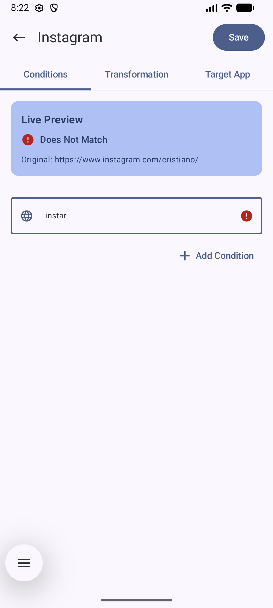
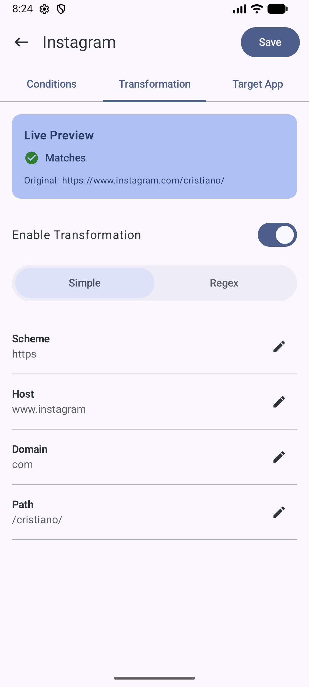
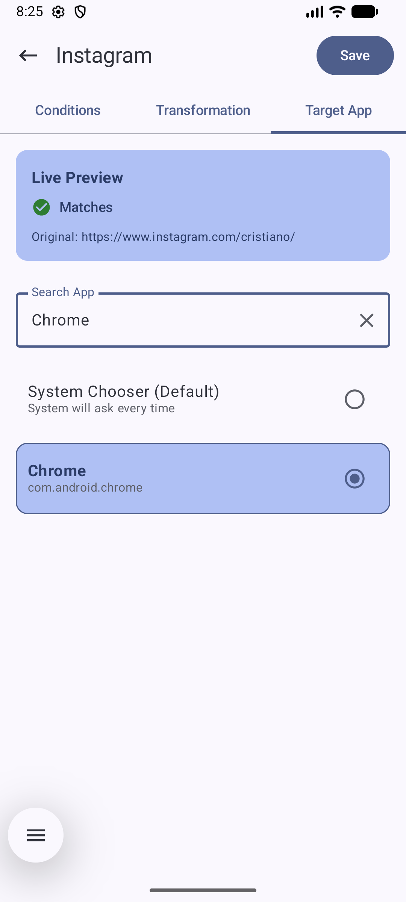
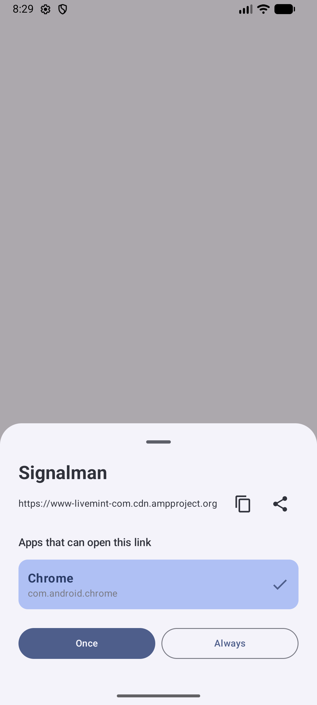

# Signalman

[](https://opensource.org/licenses/Apache-2.0)
[](https://kotlinlang.org)
[](https://developer.android.com)

Signalman is an advanced URL router for Android that acts as a default handler for HTTP and HTTPS links. It provides powerful customization options to route specific URLs to specific applications or browsers based on user-defined rules.

## Features

- **Custom URL Rules**: Create rules to route URLs to specific apps based on patterns
- **Auto Rule Generation**: Automatically prompt to create rules for new links
- **Pattern Matching**: Support for contains, equals, starts with, ends with, and regex patterns
- **URL Transformation**: Transform URLs before routing with simple or regex-based replacement
- **Browser Selection**: Choose which browsers appear in the overlay chooser
- **Import/Export**: Backup and restore your rules as JSON
- **Modern UI**: Clean, intuitive Material Design 3 interface
- **Offline First**: All data stored locally on your device

## Screenshots

<div>
  <table>
    <tr>
      <td><br/><b>Rules List</b></td>
      <td><br/><b>Edit Rule</b></td>
      <td><br/><b>Auto Rules</b></td>
    </tr>
    <tr>
      <td><br/><b>Overlay Chooser</b></td>
      <td><br/><b>Settings</b></td>
    </tr>
  </table>
</div>

## Requirements

- Android 14 (API 34) or higher
- Compatible with Android 14+

## Installation

1. Download the latest APK from the [Releases](https://github.com/sudarshandodiya/Signalman/releases) page
2. Install the APK on your Android device
3. Set Signalman as your default browser in system settings

## Usage

### Setting as Default Browser

1. Go to **Settings** → **Apps** → **Default apps** → **Browser app**
2. Select **Signalman**

### Creating a Rule

1. Tap the **+** button on the Custom tab
2. Enter a rule name and optional example URL
3. Add conditions to match URLs (e.g., contains "twitter.com")
4. Select the target app for matching URLs
5. Save the rule

### Auto Rule Generation

1. Go to the **Auto** tab
2. Enable "Enable auto rule generation"
3. Set a fallback default app (optional)
4. When you open a link that doesn't match any rule, you'll be prompted to create one

### URL Transformation

When editing a rule, you can enable transformation to modify URLs before routing:

- **Simple Mode**: Replace URL components (scheme, host, domain)
- **Regex Mode**: Use regex patterns for advanced transformations

### Import/Export Rules

1. Go to **Settings**
2. Use **Export Rules** to save all rules to a JSON file
3. Use **Import Rules** to restore rules from a JSON file

## Architecture

Signalman is built with modern Android architecture:

- **UI Layer**: Jetpack Compose with Material Design 3
- **State Management**: ViewModel with StateFlow
- **Dependency Injection**: Koin
- **Local Storage**: Room Database with DataStore for preferences
- **Async Operations**: Kotlin Coroutines

## Building from Source

### Prerequisites

- Android Studio Hedgehog (2023.1.1) or later
- JDK 11 or higher
- Android SDK with API 34

### Build Instructions

1. Clone the repository:
   ```bash
   git clone https://github.com/sudarshandodiya/Signalman.git
   cd Signalman
   ```

2. Open the project in Android Studio

3. Sync project with Gradle files

4. Build the project:
   ```bash
   ./gradlew assembleDebug
   ```

5. Or run on a connected device/emulator:
   ```bash
   ./gradlew installDebug
   ```

### Development Setup

#### Git Hooks

This project uses git hooks to ensure code quality. Install them by running:

```bash
./scripts/install-hooks.sh
```

The pre-commit hook will automatically:
- Run `spotlessApply` to format your code
- Run `detekt` to check code quality

If either check fails, the commit will be blocked until issues are fixed.

## Contributing

Contributions are welcome! Please feel free to submit a Pull Request. For major changes, please open an issue first to discuss what you would like to change.

1. Fork the repository
2. Create your feature branch (`git checkout -b feature/AmazingFeature`)
3. Commit your changes (`git commit -m 'Add some AmazingFeature'`)
4. Push to the branch (`git push origin feature/AmazingFeature`)
5. Open a Pull Request

## License

This project is licensed under the Apache License 2.0 - see the [LICENSE](LICENSE) file for details.

## Support

If you encounter any issues or have questions, please [open an issue](https://github.com/sudarshandodiya/Signalman/issues).
